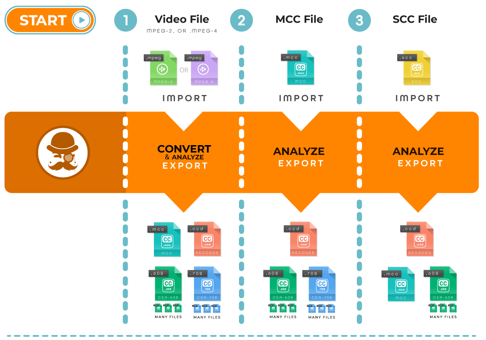

Caption Inspector
=================

The Caption Inspector project builds a C library, C executable, and Docker image that can be used to extract and decode
Closed-Captions from various Video or Caption File Formats. Caption Inspector Supports CEA-608 and CEA-708 in MPEG-2 and
MPEG-4 (.mpg, .ts, and .mp4 containers), MCC (MacCaption Closed Captions), and SCC (Scenarist Closed Captions) files.



Caption Inspector has a plugin pipeline architecture that can be configured in various ways and allows the user to add
new plugins to perform various transformations. Currently, the following are the main use cases that the Caption
Inspector Software covers:
* Pulling Captions from a Video Asset and writing them to an MCC Caption File, a [CEA-608 Decode File](./docs/decoded608.md),
a [CEA-708 Decode File](./docs/decoded708.md), and a [Closed Caption Descriptor Decode File](./docs/decodeCCD.md).
* Decoding a MCC Caption file and writing the decoded captions into  a [CEA-608 Decode File](./docs/decoded608.md),
a [CEA-708 Decode File](./docs/decoded708.md), and a [Closed Caption Descriptor Decode File](./docs/decodeCCD.md).
* Decoding a SCC Caption file and writing the decoded captions into a MCC Caption File, a [CEA-608 Decode File](./docs/decoded608.md),
and a [Closed Caption Descriptor Decode File](./docs/decodeCCD.md).

Building and Running Caption Inspector in a Docker Container
------------------------------------------------------------

TBD.

Building and Running the Caption Inspector Executable Locally
-------------------------------------------------------------

### Prerequisites to Building the Caption Inspector Executable

Caption Inspector requires FFMPEG to be installed on your machine. Please download the appropriate
version of FFMPEG from [here](https://ffmpeg.org/download.html) and install it in your machine.
Caption Inspector is known to run with FFMPEG Version 4.0.2.

While not required, Caption Inspector leverages a tool called MediaInfo to determine whether or not
an asset is, or is not, Drop Frame. You can download the command line version of MediaInfo
[here](https://mediaarea.net/en/MediaInfo/Download). Caption Inspector is known to run with
MediaInfo Version 18.12.

### Building the Caption Inspector Executable

Building the Caption Inspector executable can be done at the root level, or at the src level.

```
make caption-inspector
```

### Running the Caption Inspector Executable

Once it has been built, Caption Inspector can be used to decode the captions from a test file.

```
./caption-inspector -h
./caption-inspector test/media/BigBuckBunny_256x144-24fps.ts -o .
./caption-inspector test/media/Plan9fromOuterSpace.scc -f 2400  -o .
./caption-inspector test/media/NightOfTheLivingDead.mcc  -o .
```

Running with the `-h` option will simply print out the help text. 

Running against the video file `BigBuckBunny_256x144-24fps.ts` demonstrates decoding closed captions from a video file.

Running against the caption file `Plan9fromOuterSpace.scc` demonstrates decoding an SCC file and CEA-608 Captions, as well as
converting the contents of the SCC file into an MCC file.

Running against the caption file `NightOfTheLivingDead.mcc` demonstrates decoding an MCC file, CEA-608 Captions, and CEA-708 Captions.

Building the Caption Inspector Library and Leveraging it with Python
--------------------------------------------------------------------

TBD.


Testing the Caption Inspector Executable
----------------------------------------

TBD.

