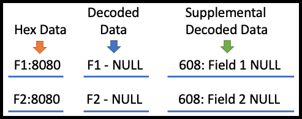
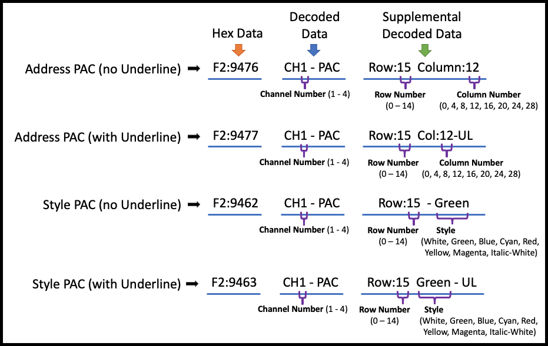
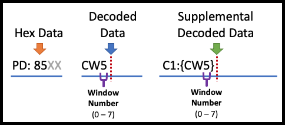
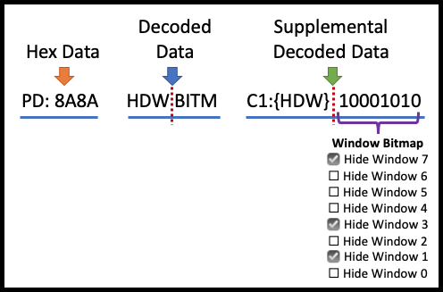
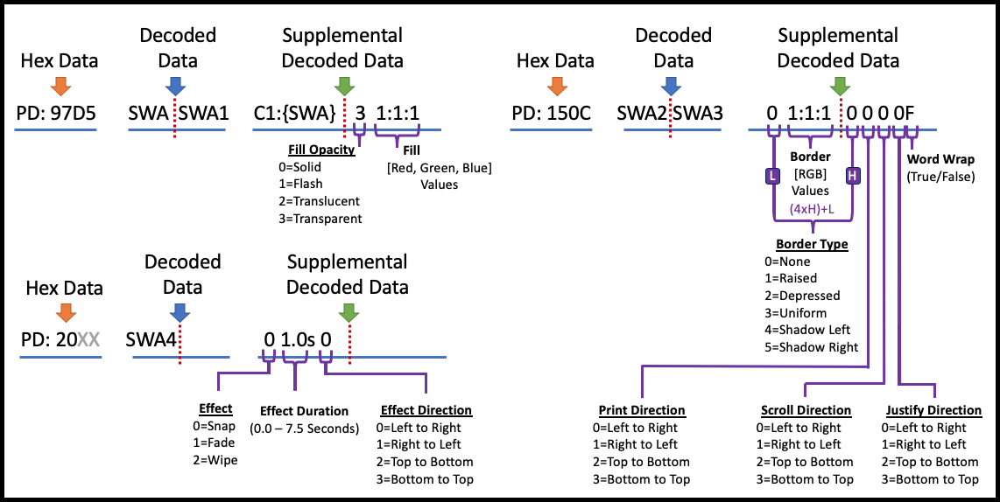

Closed Caption Descriptor Decode File (.ccd)
============================================

Caption Inspector will output a single Closed Caption Descriptor File for each asset that it processes. The Closed
Caption Descriptor Files are intended to be annotated hex dumps of the closed captioning descriptors located on
every frame of video or every line of an MCC file. Unlike the other decode artifacts, the CCD files are decoded inline,
all channels and services left multiplexed together, and have traceability back to the original/unmodified hex that
was extracted from the asset or caption file.

Here is an example of a Closed Caption Descriptor File that was produced by Caption Inspector, followed by a description
of the different elements in the file.

File Structure
--------------

The Closed Caption Descriptor File contains a decoded binary representation of Closed Captioning Data. Each grouping of
text immediately following a timestamp represents the Closed Captioning Data - `cc_data()` that would be associated with
a frame of video, or a line from an MacCaption (MCC) file. Each "line" contains the same groups of elements: Timestamp,
Hex Data, Decoded Data, Supplemental Decoded Data, and Text (if it exists in the line). These element can describe both
CEA-608 and CEA-708 data contained in the Closed Captioning Descriptors. 

Timestamp
---------

On the leftmost portion of the document is the timestamp. Each Closed Caption Data (CCD) packet has a timestamp, which
corresponds with the frame of the asset containing the CCD packet. For readability sake, the timestamp is only printed
out when specific Global Control Codes are encountered. There are three types of timestamps: Frame Number, Drop Frame
Number, and Millisecond. This refers to the last number, and the symbol that separates it from the second to last number.

Drop Frame Number Timestamps format --- `<Hour>:<Minute>:<Second>;<Frame>`

Frame Number Timestamps format --- `<Hour>:<Minute>:<Second>:<Frame>`

Millisecond Timestamps format --- `<Hour>:<Minute>:<Second>,<Millisecond>`

The Frame Number vs. Drop Frame Number is differentiated by using either a `:` for Frame or a `;` for Drop Frame. For
a description of what Drop Frame is, and why we have it, please look [here](http://www.bodenzord.com/archives/79).

Aggregated Text
---------------

If there is text detected in the line, it will be pulled together and gets labeled with the Channel or Service Number
that it is associated with. This is done to easily be able to see what the text spells out.

Hex Data
--------

The Hex Data representation of the Closed Captioning Construct is intended to be the most direct representation of the
`cc_data()` structure, which is comprised of the following fields:
 
`{cc_valid}{cc_type}:{cc_data_1}{cc_data_2}`

The `cc_valid` field determines whether the subsequent fields should considered valid and be interpreted. This field
will either be 'F' for Valid Line 21, 'P' for Valid DTVCC, or 'X' for Invalid. The `cc_type` field determines the type
of data that will be in cc_data_1 and cc_data_2. This field can have the following values: '1' Line 21 Field 1 Data, '2'
Line 21 Field 2 Data, 'S' DTVCC Packet Data Start, 'D' DTVCC Packet Data. The fields `cc_data_1` and `cc_data_2` are the
actual two bytes of payload data, which are represented in hexadecimal.

Decoded Data and Supplemental Decoded Data
------------------------------------------

Decoded Data and Supplemental Decoded Data are intended to be the inline decode of the corresponding Hex Data using
the 608 and 708 Specs. The Decoded Data is a high level decode of the code referenced by the hex value, and the
supplemental decoded data describes the flags and values referenced by the hex value. Supplemental decoded data plays
a larger role in 708 because more information is crammed into bit fields in the magic numbers.

### CEA-608 NULL Data

CEA-608 tends to have its fill data be NULL Data. NULL Data is just `0x00` with a parity bit in the msb position. Since
this is placed in specific to 608, it gets decoded to NULL (as opposed to 708 NULL Data, which is shown as a blank line).

### CEA-608 Global Control Codes

There is not much decoding to do around Global Control Codes in CEA-608. Basically it is just the Channel Number that
gets decoded and added to the Decoded Data. The Supplemental Decoded Data field is basically used to try to spell out
the control code as much as space permits, rather than using the code that is found in the Decoded Data.

### CEA-608 Preamble Access Codes (PAC)

PACs come in two types, Address PACs which describe where the cursor should be located, and Style PACs which describe
what style/color should be used when writing to the screen. The Decoded Data field denotes that the decoded code is a
PAC, and which channel it is associated with. The Supplemental Decoded Data field spells out the Address and Style
information of the PAC.

### CEA-608 Mid Row Style Change Code

Midrow Style Changes come in two types, Foreground and Background Style Change. Additionally the Foreground MidRow Style
Change can indicate that the text is Partially Transparent and the Background Midrow Style Change can indicate that the
text is underlined.

### CEA-608 Tab Control Code

Tab Controls, in combination with an Address PAC can point the cursor to anywhere inside of the text window.

### CEA-708 Packet Structure

CEA-708 is able to support 64 services, rather than the 4 channels in 608, in part by defining a variable length packet
structure and then associating each group of packets to a specific service. The packet structure is made up of
a Packet Start followed by a number of Data Packets. Receiving another Packet Start ends the current packet and tells
the closed captioning service to process all of the data that was in the previous packet structure. To make the start
of the packet structure stick out in the decoded data, it has an arrow on the Packet Start: `<-`.

### CEA-708 Spurious Data

When a byte is unexpected, it gets printed out in the below format. For this example, two unexpected 0 bytes were
encountered.

### CEA-708 Set Current Window

Set Current Window specifies the window to which all subsequent window style and pen commands are directed.

Define Window
-------------

Define Window creates a window and initializes the window with the parameters listed in the command.

Clear Windows
--------------

Clear Windows removes any existing text from the specified windows in the window map and replaces the entire window
with the window fill color.

Delete Windows
--------------

Delete Windows removes all specified windows.

Display Windows
---------------

Display Windows causes the specified windows to be visible.

Hide Windows
------------

Hide Windows causes the specified windows to be removed from the screen.

Toggle Windows
--------------

Toggle Windows causes all specified windows to toggle whether they are displayed or hidden.

Set Window Attributes
---------------------

Set Window Attributes assigns the specified style attributes to the current window.

NOTE: You need to multiply the high bit (value above the 'H') by 4 and add it to the low bits (value above the 'L') to
get the final code for the Border Type.

Set Pen Attributes
------------------

Set Pen Attributes assigns pen style attributes for the currently defined window. Text written to the current window
will have the attributes specified by the most recent Set Pen Attributes command written to the window.

Set Pen Color
-------------

Set Pen Color assigns the pen color attributes for the current window. Text written to that window will have the color
attributes specified by the most recent Set Pen Color command.

Set Pen Location
----------------

Set Pen Location repositions the pen cursor for the current window, as specified by the current window ID. When the
window justification type is 'left' the next group of text written to the current window will start at the specified
row and column, and justification will be ignored. When the window justification type is not left and the print
direction is left-to-right or right-to-left, the column parameter shall be ignored. When the window justification type
is not left and the print direction is top-to-bottom or bottom-to-top, the row parameter shall be ignored. When the
window justification type is not left, text shall be formatted based upon the current window justification type.

Delay
-----

Delay suspends interpretation of the command input buffer. Once the delay expires captioning resumes.

Delay Cancel
------------

Delay Cancel terminates an active Delay command and captioning resumes.

Reset
-----

Reset command reinitializes the service for which it is received.

Reserved
--------

Reserved Codes are just that, Reserved Codes. They are not believed to be used.

