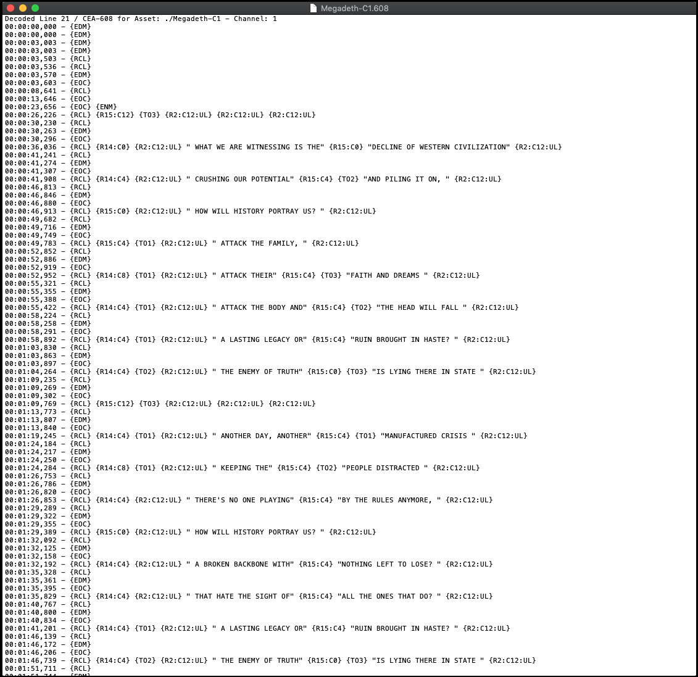

CEA-608 Decode File (.608)
==========================

Caption Inspector will output decoded CEA-608 as text with inline tags from the 608 [spec](https://en.wikipedia.org/wiki/EIA-608).
Each Channel of 608 captions that are found are written to their own file, which contains the channel number appended
to the end of the filename. This happens as a result of finding 'any' captions for a specific channel, and does not
necessarily indicate that a specific channel is a valid channel with captions. Sometimes it is just random garbage
that is in the captioning and decodes as data for a specific channel which was not intended to have captions.

Here is an example of a Decoded CEA-608 file that was produced by Caption Inspector, followed by a description of the
different elements in the file.

Timestamp
---------

On the leftmost portion of the document is the timestamp. Each Closed Caption Data (CCD) packet has a timestamp, which
corresponds with the frame of the asset containing the CCD packet. For readability sake, the timestamp is only printed
out when specific Global Control Codes are encountered. There are three types of timestamps: Frame Number, Drop Frame
Number, and Millisecond. This refers to the last number, and the symbol that separates it from the second to last number.

Drop Frame Number Timestamps format --- `<Hour>:<Minute>:<Second>;<Frame>`

Frame Number Timestamps format --- `<Hour>:<Minute>:<Second>:<Frame>`

Millisecond Timestamps format --- `<Hour>:<Minute>:<Second>,<Millisecond>`

The Frame Number vs. Drop Frame Number is differentiated by using either a `:` for Frame or a `;` for Drop Frame. For
a description of what Drop Frame is, and why we have it, please look [here](http://www.bodenzord.com/archives/79).

Text
----

The text is merely wrapped in quotes, with all whitespaces preserved inside of the quotes. If there are quotes in
the text, they will be printed out directly and will not be escaped out.

Inline Representation of Global Control Codes
---------------------------------------------

The Global Control are represented inline by wrapping the mnemonic code with braces: `{Code}` The codes can be
interpreted using the following table.

Inline Representation of Preamble Access Codes (PAC)
----------------------------------------------------

There are two types of PACs, Address and Style. Address PACs relate specifically to positioning, and Style PACs
describe the color of the captions.

Inline Representation of Mid Row Style Change Code
--------------------------------------------------

The Mid Row Style Change codes affect the current row that they are encountered in. The new style remains in effect
until either next change or end of row signaled by a Global Control Code or Preamble Access Code. The Mid Row Style
Change will either change the Foreground Color or the Background Color. Additionally, it will signal whether the
text is either Underlined, Partially Transparent, or both.

Inline Representation of Tab Control Codes
------------------------------------------

Tab Control codes are used for positioning the captions. Specifically, they tell how far to move to the right from
the current position. Used in conjunction with the Column Number from the Address PAC, it allows the captions to
be placed anywhere in the text field.

