CEA-708 Decode File (.708)
==========================

Caption Inspector will output decoded CEA-708 as text with inline tags from the 708 [spec](https://en.wikipedia.org/wiki/CEA-708).
Each Service of 708 captions that are found are written in their own file, regardless of whether or not there are full
and valid captions associated with the specific service.

Here is an example of a Decoded CEA-708 file that was produced by Caption Inspector, followed by a description of the
different elements in the file.

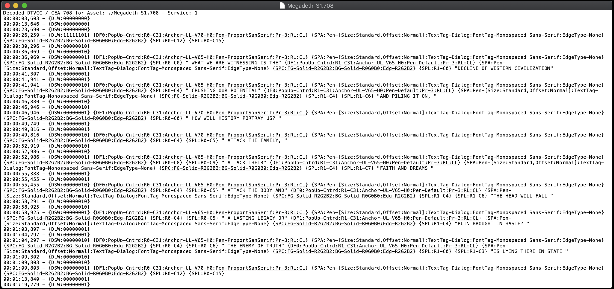

Timestamp
---------

On the leftmost portion of the document is the timestamp. Each Closed Caption Data (CCD) packet has a timestamp, which
corresponds with the frame of the asset containing the CCD packet. For readability sake, the timestamp is only printed
out when specific Global Control Codes are encountered. There are three types of timestamps: Frame Number, Drop Frame
Number, and Millisecond. This refers to the last number, and the symbol that separates it from the second to last number.

Drop Frame Number Timestamps format --- `<Hour>:<Minute>:<Second>;<Frame>`

Frame Number Timestamps format --- `<Hour>:<Minute>:<Second>:<Frame>`

Millisecond Timestamps format --- `<Hour>:<Minute>:<Second>,<Millisecond>`

The Frame Number vs. Drop Frame Number is differentiated by using either a `:` for Frame or a `;` for Drop Frame. For
a description of what Drop Frame is, and why we have it, please look [here](http://www.bodenzord.com/archives/79).

Text
----

The text is merely wrapped in quotes, with all whitespaces preserved inside of the quotes. If there are quotes in
the text, they will be printed out directly and will not be escaped out or anything like that.

Set Current Window
------------------

Set Current Window specifies the window to which all subsequent window style and pen commands are directed.

Define Window
-------------

Define Window creates a window and initializes the window with the parameters listed in the command.

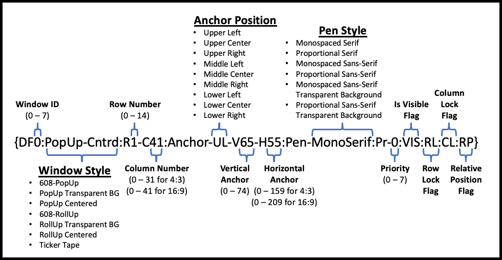

Clear Windows
--------------

Clear Windows removes any existing text from the specified windows in the window map and replaces the entire window
with the window fill color.

Delete Windows
--------------

Delete Windows removes all specified windows.

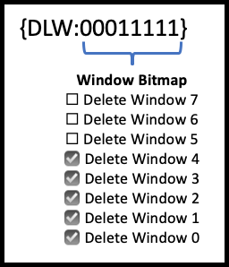

Display Windows
---------------

Display Windows causes the specified windows to be visible.

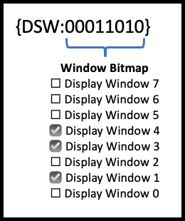

Hide Windows
------------

Hide Windows causes the specified windows to be removed from the screen.

Toggle Windows
--------------

Toggle Windows causes all specified windows to toggle whether they are displayed or hidden.

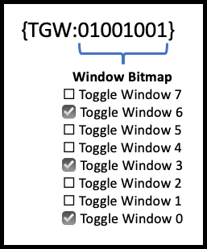

Set Window Attributes
---------------------

Set Window Attributes assigns the specified style attributes to the current window.

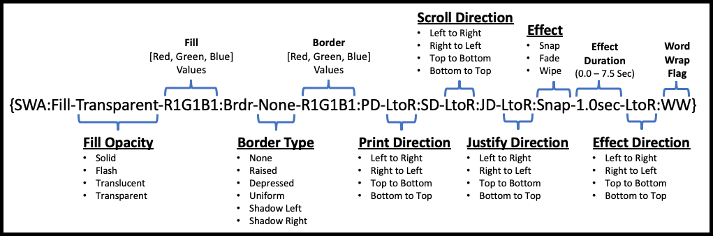

Set Pen Attributes
------------------

Set Pen Attributes assigns pen style attributes for the currently defined window. Text written to the current window
will have the attributes specified by the most recent Set Pen Attributes command written to the window.

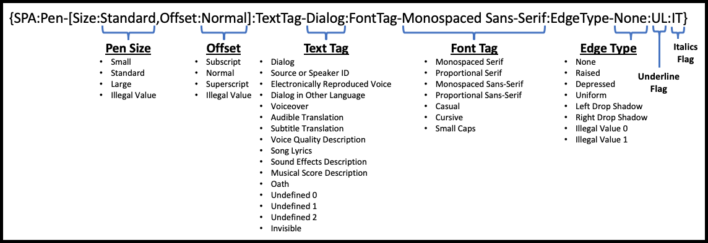

Set Pen Color
-------------

Set Pen Color assigns the pen color attributes for the current window. Text written to that window will have the color
attributes specified by the most recent Set Pen Color command.

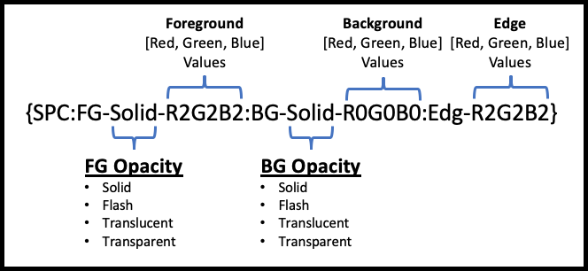

Set Pen Location
----------------

Set Pen Location repositions the pen cursor for the current window, as specified by the current window ID. When the
window justification type is 'left' the next group of text written to the current window will start at the specified
row and column, and justification will be ignored. When the window justification type is not left and the print
direction is left-to-right or right-to-left, the column parameter shall be ignored. When the window justification type
is not left and the print direction is top-to-bottom or bottom-to-top, the row parameter shall be ignored. When the
window justification type is not left, text shall be formatted based upon the current window justification type.

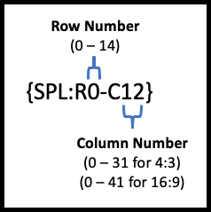

Delay
-----

Delay suspends interpretation of the command input buffer. Once the delay expires captioning resumes.

Delay Cancel
------------

Delay Cancel terminates an active Delay command and captioning resumes.

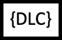

Reset
-----

Reset command reinitializes the service for which it is received.

Reserved
--------

Reserved Codes are just that, Reserved Codes. They are not believed to be used.

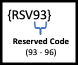
